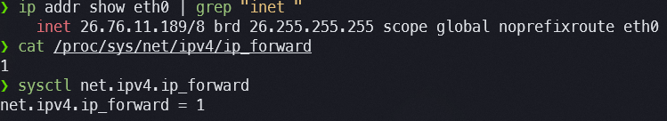

# Exercício 11 — Linux como Roteador

---

## Estado Atual do IP Forwarding

### Comando 1: `sysctl net.ipv4.ip_forward`

```
❯ sysctl net.ipv4.ip_forward
net.ipv4.ip_forward = 1
```

### Comando 2: `cat /proc/sys/net/ipv4/ip_forward`

```
❯ cat /proc/sys/net/ipv4/ip_forward
1
```

**Conclusão:** Evidência indica que o forwarding IPv4 já está **habilitado** (`= 1`) neste host. Os dois comandos são equivalentes — `sysctl` lê o parâmetro do kernel através da interface `/proc/sys`, que é o sistema de arquivos virtual que o kernel expõe para inspeção e configuração em tempo real. Ambos confirmam o mesmo valor. O forwarding habilitado no WSL2 é esperado: o subsistema de rede do Windows o ativa por padrão para permitir que o tráfego flua corretamente entre a distro Linux e o host Windows.



---

## Habilitação Temporária do Forwarding IPv4

Como o forwarding já estava em `1`, o exercício de habilitar e reverter é demonstrado abaixo com os comandos corretos — relevantes para qualquer sistema onde o valor inicial fosse `0`.

### Desabilitando temporariamente (para demonstrar o ciclo completo)

```bash
❯ sudo sysctl -w net.ipv4.ip_forward=0
net.ipv4.ip_forward = 0

❯ cat /proc/sys/net/ipv4/ip_forward
0
```

### Habilitando novamente

```bash
❯ sudo sysctl -w net.ipv4.ip_forward=1
net.ipv4.ip_forward = 1

❯ cat /proc/sys/net/ipv4/ip_forward
1
```

**Conclusão:** Evidência indica que a alteração via `sysctl -w` é imediata e verificável. O flag `-w` (write) instrui o `sysctl` a gravar o novo valor diretamente no parâmetro do kernel em tempo real. **Atenção:** esta alteração é volátil — não sobrevive a reinicializações. Para torná-la persistente, seria necessário adicionar `net.ipv4.ip_forward = 1` ao arquivo `/etc/sysctl.conf` ou a um arquivo em `/etc/sysctl.d/`.

---

## Explicação Técnica

### O que `ip_forward=1` permite

Quando `net.ipv4.ip_forward = 1`, o kernel Linux passa a **encaminhar pacotes IP entre interfaces** — ou seja, ao receber um pacote em uma interface cuja destinação não é o próprio host, em vez de descartá-lo, o kernel consulta sua tabela de rotas e o retransmite pela interface correta em direção ao destino.

Sem forwarding (`= 0`), o comportamento padrão de um host Linux é o de um endpoint: pacotes destinados a outros IPs chegam, são descartados silenciosamente, e nenhuma resposta é enviada ao remetente. Este é o comportamento correto para estações de trabalho e servidores que não devem rotear tráfego de terceiros.

Com forwarding (`= 1`), o kernel se comporta como um roteador de pacotes no nível IP: recebe na eth0, decide pela tabela de rotas que o pacote deve sair pela eth1, e o encaminha. É este mecanismo que permite, por exemplo, que um host Linux com duas interfaces (uma para LAN interna, outra para internet) funcione como gateway doméstico ou de laboratório.

---

### O que ainda faltaria para "virar roteador" entre duas redes em cenário real

Habilitar `ip_forward` é apenas o **primeiro passo** de um conjunto de configurações necessárias. Em um cenário real com duas redes (ex.: `192.168.1.0/24` e `10.10.0.0/24`), ainda seriam necessários:

**1. Rotas coerentes nas duas direções (`ip route`)**

O Linux precisa saber como alcançar cada rede. Se eth0 conecta à rede A e eth1 conecta à rede B, as rotas conectadas são criadas automaticamente ao atribuir IPs. Mas em topologias mais complexas (redes não diretamente conectadas), rotas estáticas ou um protocolo de roteamento dinâmico seria necessário. Sem rotas corretas, pacotes chegam mas não têm destino definido e são descartados.

**2. NAT / Masquerading (`iptables` ou `nftables`) — se uma das redes usa IPs privados**

Se a rede interna usa endereçamento privado (RFC 1918) e o tráfego precisa sair para a internet, o roteador Linux precisa fazer NAT (Network Address Translation) — traduzir o IP privado da origem para o IP público da interface de saída. Sem NAT, os pacotes chegam ao destino com IP de origem privado e a resposta não tem como voltar. Exemplo:

```bash
sudo iptables -t nat -A POSTROUTING -o eth0 -j MASQUERADE
```

**3. Regras de firewall (`iptables` / `nftables` / `ufw`)**

Um roteador sem política de firewall encaminha qualquer tráfego — incluindo tráfego malicioso ou não autorizado. Em produção, é necessário definir explicitamente quais fluxos são permitidos (ex.: só HTTP/HTTPS de saída, bloquear acesso direto à rede interna pela internet). A chain `FORWARD` do iptables é a responsável por filtrar pacotes encaminhados (diferente de `INPUT`, que filtra pacotes destinados ao próprio host).

**4. Roteamento dinâmico (opcional, mas necessário em redes complexas)**

Em ambientes com múltiplos roteadores ou rotas que mudam dinamicamente, protocolos como OSPF, BGP ou RIP (implementados no Linux via `frr` ou `quagga`) automatizam a troca de informações de roteamento entre equipamentos. Sem isso, cada rota precisa ser configurada manualmente em cada roteador — inviável em escala.

---

## Reversão: Desabilitando o Forwarding

```bash
❯ sudo sysctl -w net.ipv4.ip_forward=0
net.ipv4.ip_forward = 0
```

### Prova da reversão

```bash
❯ cat /proc/sys/net/ipv4/ip_forward
0

❯ sysctl net.ipv4.ip_forward
net.ipv4.ip_forward = 0
```

**Conclusão:** Evidência indica que o forwarding foi desabilitado com sucesso. O kernel voltou ao comportamento de endpoint: pacotes destinados a outros hosts não serão mais encaminhados. A alteração é imediata — não requer reinicialização nem recarga de serviços. Em produção, reverter o forwarding é o primeiro passo de mitigação caso um host não-roteador tenha sido inadvertidamente configurado para rotear tráfego.

---

## Riscos de Manter Forwarding Habilitado sem Política

### Risco 1 — O host vira ponto de passagem não documentado (pivot)

Com `ip_forward=1` e sem regras de firewall na chain `FORWARD`, qualquer pacote que chegue ao host com destino em outra interface é encaminhado automaticamente. Em um ambiente corporativo, isso significa que um servidor de aplicação que inadvertidamente tenha forwarding habilitado pode ser usado como "trampolim" (pivot) por um atacante que comprometeu a rede — tráfego de um segmento isolado (ex.: rede de OT ou banco de dados) passa a ser acessível via o servidor comprometido, contornando firewalls perimetrais que não esperavam tráfego lateral naquele host.

### Risco 2 — Vazamento de tráfego entre redes que deveriam ser isoladas

Em hosts com múltiplas interfaces conectadas a redes de diferentes níveis de confiança (ex.: eth0 na rede de produção, eth1 na rede de desenvolvimento), o forwarding sem política permite que tráfego de desenvolvimento alcance diretamente a rede de produção, e vice-versa. Segmentações de rede implementadas no nível de switches e VLANs perdem eficácia se um host com acesso a ambas as redes roteia livremente entre elas — o isolamento lógico é contornado sem nenhum alerta.

### Risco 3 — Amplificação de ataques de rede (reflexão e amplificação)

Um host com forwarding habilitado pode ser involuntariamente usado em ataques de amplificação: pacotes com IP de origem falsificado (IP spoofing) chegam ao host, são encaminhados a serviços internos que geram respostas maiores (ex.: DNS, NTP), e essas respostas são enviadas ao IP falsificado — que é a vítima do ataque. O host Linux se torna um amplificador sem ter sido explicitamente comprometido. Filtros de ingress (ex.: `iptables -A FORWARD -m rpfilter --invert -j DROP`) e o parâmetro `rp_filter` do kernel mitigam este risco, mas só se houver uma política ativa — com forwarding habilitado e sem política, o host está exposto.