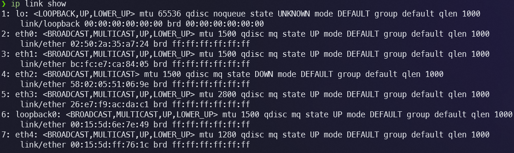
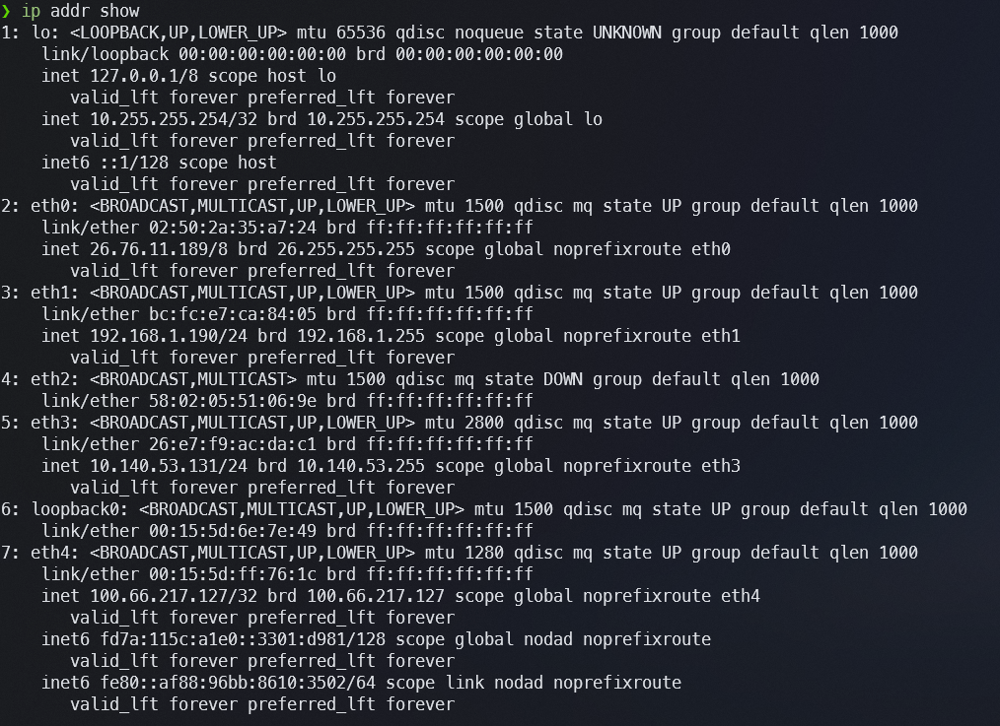
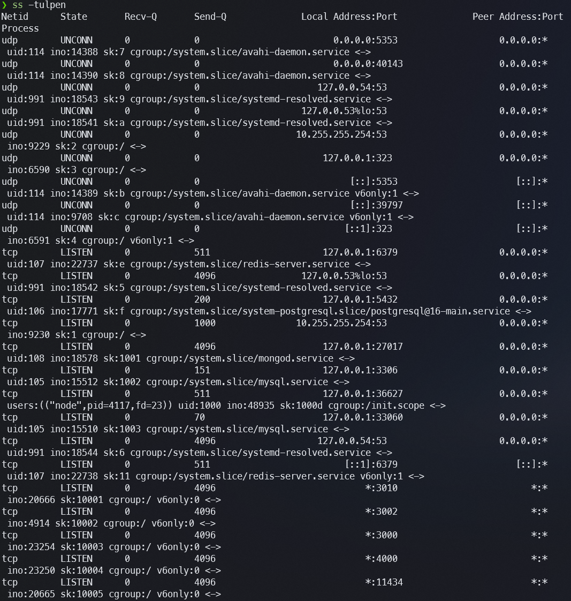

# Exercício 1 — Runbook por Camadas: Internet no Linux

---

## Camada 1/2 — Enlace (Link Layer)

### Comando 1: `ip link show`

```
❯ ip link show
1: lo: <LOOPBACK,UP,LOWER_UP> mtu 65536 qdisc noqueue state UNKNOWN mode DEFAULT group default qlen 1000
    link/loopback 00:00:00:00:00:00 brd 00:00:00:00:00:00
2: eth0: <BROADCAST,MULTICAST,UP,LOWER_UP> mtu 1500 qdisc mq state UP mode DEFAULT group default qlen 1000
    link/ether 02:50:2a:35:a7:24 brd ff:ff:ff:ff:ff:ff
3: eth1: <BROADCAST,MULTICAST,UP,LOWER_UP> mtu 1500 qdisc mq state UP mode DEFAULT group default qlen 1000
    link/ether bc:fc:e7:ca:84:05 brd ff:ff:ff:ff:ff:ff
4: eth2: <BROADCAST,MULTICAST,UP,LOWER_UP> mtu 2800 qdisc mq state UP mode DEFAULT group default qlen 1000
    link/ether 26:e7:f9:ac:da:c1 brd ff:ff:ff:ff:ff:ff
5: loopback0: <BROADCAST,MULTICAST,UP,LOWER_UP> mtu 1500 qdisc mq state UP mode DEFAULT group default qlen 1000
    link/ether 00:15:5d:6e:7e:49 brd ff:ff:ff:ff:ff:ff
6: eth3: <BROADCAST,MULTICAST,UP,LOWER_UP> mtu 1280 qdisc mq state UP mode DEFAULT group default qlen 1000
    link/ether 00:15:5d:ff:76:1c brd ff:ff:ff:ff:ff:ff
7: eth4: <BROADCAST,MULTICAST> mtu 1500 qdisc mq state DOWN mode DEFAULT group default qlen 1000
    link/ether 58:02:05:51:06:9e brd ff:ff:ff:ff:ff:ff
```

**Conclusão:** Evidência indica que as interfaces eth0, eth1, eth2, eth3 e loopback0 estão com estado `UP` e flag `LOWER_UP` (enlace físico ativo). A interface eth4 está `DOWN`, sem enlace físico. O campo `link/ether` exibe o endereço MAC de cada interface, confirmando a identidade de camada 2. O MTU de eth2 (2800) e eth3 (1280) difere do padrão Ethernet (1500), o que é esperado em interfaces virtuais WSL com tunelamento.



---

### Comando 2: `ip -s link`

```
❯ ip -s link
2: eth0: <BROADCAST,MULTICAST,UP,LOWER_UP> mtu 1500 ...
    RX:  bytes packets errors dropped  missed   mcast
          8475      65      0       0       0      10
    TX:  bytes packets errors dropped carrier collsns
          6743      60      0       0       0       0
3: eth1: <BROADCAST,MULTICAST,UP,LOWER_UP> mtu 1500 ...
    RX:  bytes packets errors dropped  missed   mcast
       6929125   10658      0       0       0     337
    TX:  bytes packets errors dropped carrier collsns
       1833782    8054      0       0       0       0
7: eth4: <BROADCAST,MULTICAST> mtu 1500 ...
    RX:  bytes packets errors dropped  missed   mcast
             0       0      0       0       0       0
    TX:  bytes packets errors dropped carrier collsns
             0       0      0       0       0       0
```

**Conclusão:** Evidência indica que eth1 possui alto volume de tráfego RX (≈6,9 MB recebidos, 10.658 pacotes), sendo a interface mais ativa — coerente com ser a interface de rede doméstica principal. Os contadores de `errors` e `dropped` zerados em todas as interfaces confirmam enlace estável, sem descarte de quadros. eth4 com todos os contadores zerados confirma que está fisicamente desconectada e sem tráfego.

---

## Camada 3 — Rede (IP)

### Comando 3: `ip addr show`

```
❯ ip addr show
1: lo: ...
    inet 127.0.0.1/8 scope host lo
    inet 10.255.255.254/32 brd 10.255.255.254 scope global lo
    inet6 ::1/128 scope host
2: eth0: ...
    inet 26.76.11.189/8 brd 26.255.255.255 scope global noprefixroute eth0
3: eth1: ...
    inet 192.168.1.190/24 brd 192.168.1.255 scope global noprefixroute eth1
4: eth2: ...
    inet 10.140.53.131/24 brd 10.140.53.255 scope global noprefixroute eth2
6: eth3: ...
    inet 100.66.217.127/32 brd 100.66.217.127 scope global noprefixroute eth3
    inet6 fd7a:115c:a1e0::3301:d981/128 scope global nodad noprefixroute
    inet6 fe80::af88:96bb:8610:3502/64 scope link nodad noprefixroute
```

**Conclusão:** Evidência indica que o host possui múltiplos endereços IPv4 em interfaces distintas: eth1 (192.168.1.190/24) é a LAN doméstica, eth0 (26.76.11.189/8) e eth2 (10.140.53.131/24) são interfaces WSL/virtuais adicionais, e eth3 (100.66.217.127/32) pertence à rede Tailscale (VPN mesh). Somente eth3 possui endereço IPv6 global (`fd7a::/48`) e link-local (`fe80::`), o que indica que IPv6 funciona exclusivamente via Tailscale neste ambiente.



---

### Comando 4: `ip route`

```
❯ ip route
default via 192.168.1.1 dev eth1 proto kernel metric 25
default via 26.0.0.1 dev eth0 proto kernel metric 9257
default via 25.255.255.254 dev eth2 proto kernel metric 10034
10.140.53.0/24 dev eth2 proto kernel scope link metric 291
25.255.255.254 dev eth2 proto kernel scope link metric 10034
26.0.0.0/8 dev eth0 proto kernel scope link metric 257
26.0.0.1 dev eth0 proto kernel scope link metric 9257
100.72.245.97 dev eth3 proto kernel scope link metric 5
100.85.29.79 dev eth3 proto kernel scope link metric 5
100.100.100.100 dev eth3 proto kernel scope link metric 5
100.110.248.52 dev eth3 proto kernel scope link metric 5
192.168.1.0/24 dev eth1 proto kernel scope link metric 281
192.168.1.1 dev eth1 proto kernel scope link metric 25
```

**Conclusão:** Evidência indica que há três rotas default, com métricas diferentes. O kernel escolherá a de menor métrica: `default via 192.168.1.1 dev eth1 metric 25`, portanto eth1 (LAN doméstica) é o gateway primário. As demais rotas default (eth0, eth2) são failover automático com métricas muito maiores. As entradas da Tailscale (eth3, metric 5) apontam para IPs específicos /32, não são rotas default.

---

## Camada 4 — Transporte (TCP/UDP)

### Comando 5: `ss -tulpen`

```
❯ ss -tulpen
Netid  State  Recv-Q  Send-Q  Local Address:Port  Peer Address:Port  Process
tcp    LISTEN 0       70      127.0.0.1:33060      0.0.0.0:*   uid:105 ... mysql.service
tcp    LISTEN 0       4096    127.0.0.1:27017      0.0.0.0:*   uid:108 ... mongod.service
tcp    LISTEN 0       151     127.0.0.1:3306       0.0.0.0:*   uid:105 ... mysql.service
tcp    LISTEN 0       511     127.0.0.1:37177      0.0.0.0:*   users:(("node",...))
tcp    LISTEN 0       200     127.0.0.1:5432       0.0.0.0:*   uid:106 ... postgresql
tcp    LISTEN 0       511     127.0.0.1:6379       0.0.0.0:*   uid:107 ... redis-server
tcp    LISTEN 0       4096    *:4000               *:*          ...
tcp    LISTEN 0       4096    *:11434              *:*          ...
tcp    LISTEN 0       4096    *:3000               *:*          ...
tcp    LISTEN 0       4096    *:3002               *:*          ...
```

**Conclusão:** Evidência indica que serviços de banco de dados (MySQL na 3306 e 33060, MongoDB na 27017, PostgreSQL na 5432, Redis na 6379) estão vinculados exclusivamente a `127.0.0.1`, limitando acesso à loopback (boa prática de segurança). Portas 3000, 3002, 4000 e 11434 estão abertas em `*` (0.0.0.0 + ::), ou seja, acessíveis externamente — provavelmente aplicações web de desenvolvimento e Ollama (11434). Isso representa superfície de ataque que deve ser avaliada.



---

### Comando 6: `ss -tuln`

```
❯ ss -tuln
Netid   State   Recv-Q  Send-Q  Local Address:Port  Peer Address:Port
udp     UNCONN  0       0       0.0.0.0:5353         0.0.0.0:*
udp     UNCONN  0       0       127.0.0.54:53        0.0.0.0:*
udp     UNCONN  0       0       127.0.0.53%lo:53     0.0.0.0:*
udp     UNCONN  0       0       10.255.255.254:53    0.0.0.0:*
tcp     LISTEN  0       4096    127.0.0.53%lo:53     0.0.0.0:*
tcp     LISTEN  0       1000    10.255.255.254:53    0.0.0.0:*
```

**Conclusão:** Evidência indica que o resolvedor local (systemd-resolved) escuta em UDP e TCP na porta 53 via `127.0.0.53` (stub resolver padrão do systemd) e em `10.255.255.254` (interface interna WSL para DNS). O mDNS (avahi-daemon) ocupa a porta UDP 5353 em 0.0.0.0, permitindo descoberta de serviços na rede local.

---

## Resolução de Nomes (DNS/hosts)

### Comando 7: `cat /etc/hosts`

```
❯ cat /etc/hosts
127.0.0.1       localhost
127.0.1.1       WinCore.localdomain     WinCore
::1     ip6-localhost ip6-loopback
fe00::0 ip6-localnet
ff00::0 ip6-mcastprefix
ff02::1 ip6-allnodes
ff02::2 ip6-allrouters
```

**Conclusão:** Evidência indica que o `/etc/hosts` foi gerado automaticamente pelo WSL (conforme comentário no arquivo). Contém apenas entradas padrão: loopback IPv4/IPv6 e o hostname `WinCore` mapeado para 127.0.1.1. Não há entradas customizadas — toda resolução de nomes externos é delegada ao DNS configurado no resolv.conf.

---

### Comando 8: `cat /etc/resolv.conf` e `getent hosts google.com`

```
❯ cat /etc/resolv.conf
nameserver 10.255.255.254
search tail7f9064.ts.net

❯ getent hosts google.com
2800:3f0:4004:80d::200e google.com
```

**Conclusão:** Evidência indica que o nameserver configurado é `10.255.255.254`, que é o DNS interno do WSL (proxy para o DNS do Windows host). O domínio de busca `tail7f9064.ts.net` é o domínio da rede Tailscale, o que confirma que a VPN está ativa e influenciando a resolução. O `getent hosts` retornou um endereço IPv6 (`2800:3f0:...`) para google.com, indicando que o sistema prefere AAAA quando disponível — graças ao IPv6 da Tailscale.

---

## Camada 7 — Aplicação

### Comando 9: `ping -c 3 8.8.8.8` e `ping -c 3 google.com`

```
❯ ping -c 3 8.8.8.8
64 bytes from 8.8.8.8: icmp_seq=1 ttl=108 time=56.8 ms
64 bytes from 8.8.8.8: icmp_seq=2 ttl=108 time=54.8 ms
64 bytes from 8.8.8.8: icmp_seq=3 ttl=108 time=56.6 ms
3 packets transmitted, 3 received, 0% packet loss

❯ ping -c 3 google.com
64 bytes from gru14s27-in-f14.1e100.net (142.250.219.14): icmp_seq=1 ttl=108 time=57.2 ms
3 packets transmitted, 3 received, 0% packet loss
```

**Conclusão:** Evidência indica conectividade IP funcional até a internet (8.8.8.8 alcançável com 0% de perda). O ping por nome (google.com) também funcionou, confirmando que DNS está operando corretamente. O TTL=108 indica que os pacotes atravessam aproximadamente 20 hops até o destino (TTL inicial típico de 128).

---

### Comando 10: `curl -I https://www.google.com`

```
❯ curl -I https://www.google.com
HTTP/2 200
content-type: text/html; charset=ISO-8859-1
server: gws
date: Tue, 12 May 2026 01:35:04 GMT
```

**Conclusão:** Evidência indica que a camada de aplicação está funcionando ponta-a-ponta: TLS foi negociado com sucesso (HTTPS), o servidor respondeu HTTP/2 com status 200, e os headers foram recebidos corretamente. Isso valida todas as camadas inferiores simultaneamente: enlace, rede, transporte e resolução de nomes.

---

## Hipótese e Verificação

### Hipótese 1 (camada baixa): "A interface de rede está DOWN e por isso não há conectividade"

Esta é uma falha típica de camada 2 (enlace). Seria evidenciada por:
- `ip link show` retornando estado `DOWN` na interface principal
- `ip -s link` mostrando contadores RX/TX zerados
- Ausência de endereço IP atribuído em `ip addr show`

**Verificação pelo runbook:** Os dados coletados **refutam** esta hipótese no ambiente atual. `ip link show` confirma que eth0, eth1, eth2 e eth3 estão `UP LOWER_UP`. Os contadores de `ip -s link` mostram tráfego ativo em eth1 (>6,9 MB RX). A interface eth4 está DOWN, porém ela não possui IP atribuído e não é a interface principal — logo, sua queda não afeta conectividade.

---

### Hipótese 2 (camada alta): "O DNS está com falha e por isso aplicações não conectam"

Esta é uma falha típica de camada 7 (resolução de nomes), que simula "queda de rede" para o usuário. Seria evidenciada por:
- `getent hosts google.com` retornando vazio ou erro
- `ping 8.8.8.8` funcionando, mas `ping google.com` falhando
- `cat /etc/resolv.conf` sem nameserver configurado

**Verificação pelo runbook:** Os dados coletados **refutam** esta hipótese. `getent hosts google.com` retornou endereço IPv6 válido. `ping google.com` resolveu para 142.250.219.14 e obteve 0% de perda. O resolv.conf possui nameserver `10.255.255.254` configurado. DNS está operacional.