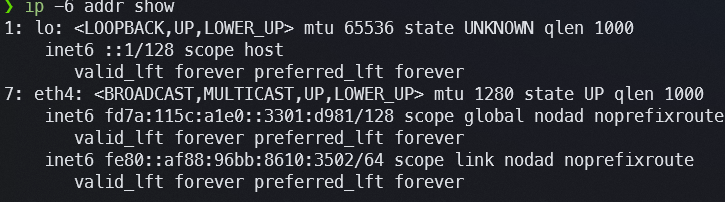
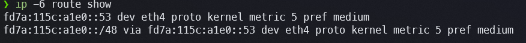

# Exercício 5 — Configuração IPv6

---

## Comandos Executados

### `ip -6 addr show`

```
❯ ip -6 addr show
1: lo: <LOOPBACK,UP,LOWER_UP> mtu 65536 state UNKNOWN qlen 1000
    inet6 ::1/128 scope host
       valid_lft forever preferred_lft forever
6: eth3: <BROADCAST,MULTICAST,UP,LOWER_UP> mtu 1280 state UP qlen 1000
    inet6 fd7a:115c:a1e0::3301:d981/128 scope global nodad noprefixroute
       valid_lft forever preferred_lft forever
    inet6 fe80::af88:96bb:8610:3502/64 scope link nodad noprefixroute
       valid_lft forever preferred_lft forever
```



---

### `ip -6 route show`

```
❯ ip -6 route show
fd7a:115c:a1e0::53 dev eth3 proto kernel metric 5 pref medium
fd7a:115c:a1e0::/48 via fd7a:115c:a1e0::53 dev eth3 proto kernel metric 5 pref medium
```



---

## Classificação dos Endereços IPv6 por Interface

### Interface `lo` (loopback)

| Endereço | Escopo | Tipo |
|---|---|---|
| `::1/128` | `host` | Loopback IPv6 — equivalente ao 127.0.0.1/8 do IPv4 |

`::1` é o endereço de loopback IPv6 padronizado no RFC 4291. Escopo `host` significa que só é visível internamente ao próprio host — não trafega por nenhuma interface física. É automaticamente configurado pelo kernel e utilizado para comunicação entre processos no mesmo sistema.

---

### Interface `eth3` (Tailscale VPN)

| Endereço | Escopo | Tipo | Classificação |
|---|---|---|---|
| `fd7a:115c:a1e0::3301:d981/128` | `global` | ULA (Unique Local Address) | **Endereço global privado** — roteável na VPN, não na internet |
| `fe80::af88:96bb:8610:3502/64` | `link` | Link-local | **Link-local** — visível apenas no segmento direto de eth3 |

**Explicação dos tipos:**

- **Link-local (`fe80::/10`):** Todo endereço no bloco `fe80::/10` é autoconfigurado pelo kernel via SLAAC ao ativar a interface (RFC 4862). Ele existe em toda interface IPv6 ativa e é **obrigatório** para o funcionamento de protocolos como NDP (Neighbor Discovery Protocol), que substitui o ARP do IPv4. Não é roteável além do enlace — tentar pingar `fe80::` de outra rede é impossível. É identificado no `ip addr` pelo campo `scope link`.

- **Global ULA (`fd7a::/48`):** O prefixo `fd00::/8` define endereços ULA (RFC 4193), que são o equivalente IPv6 dos ranges privados do IPv4 (10.x, 172.16.x, 192.168.x). O prefixo `fd7a:115c:a1e0::/48` pertence à Tailscale, que o atribui à rede mesh da VPN. Apesar do campo `scope global`, **não é roteável na internet pública** — apenas dentro da rede Tailscale. O flag `nodad` indica que a verificação de endereço duplicado (Duplicate Address Detection) foi desabilitada, o que é prática comum em interfaces VPN onde o endereço é garantidamente único.

---

### Interfaces sem endereço IPv6

As interfaces eth0, eth1, eth2 e eth4 **não possuem nenhum endereço IPv6** — nem link-local. Isso indica que o kernel não executou SLAAC nessas interfaces, provavelmente porque o gerenciador de rede do WSL não habilitou IPv6 nelas. Em um sistema Linux nativo conectado a um roteador com IPv6, cada interface ativa receberia automaticamente ao menos um endereço `fe80::`.

---

## Rota Default IPv6: Impacto de Existir ou Não

### Estado atual: **sem rota default IPv6**

```
fd7a:115c:a1e0::53 dev eth3 proto kernel metric 5 pref medium
fd7a:115c:a1e0::/48 via fd7a:115c:a1e0::53 dev eth3 proto kernel metric 5 pref medium
```

Não há nenhuma linha `default` nem `::/0` na tabela IPv6. As únicas rotas existentes cobrem endereços internos da Tailscale.

**Impacto da ausência:** Qualquer pacote IPv6 destinado a um endereço fora de `fd7a:115c:a1e0::/48` será descartado pelo kernel com erro `ENETUNREACH` (Network unreachable). Aplicações que tentarem conectar a destinos externos via IPv6 falharão — por exemplo, `curl -6 https://ipv6.google.com` retornaria erro. Em sistemas dual-stack, o fallback para IPv4 geralmente evita falha visível ao usuário, mas em sistemas IPv6-only a ausência da rota default causa indisponibilidade total.

**Impacto se existisse (`ip -6 route add default via <gateway> dev eth3`):** O kernel passaria a encaminhar todo tráfego IPv6 sem rota específica ao gateway configurado. Aplicações poderiam conectar a qualquer destino IPv6 na internet. O sistema se tornaria operacionalmente dual-stack de forma completa — resolvendo AAAA no DNS e priorizando IPv6 (conforme RFC 6724, IPv6 global é preferido sobre IPv4 quando ambos estão disponíveis).

---

## Comparação de Interfaces IPv6

### Interface `eth3` (Tailscale) — interface com IPv6

- **Link-local:** `fe80::af88:96bb:8610:3502/64` — presente, gerado via EUI-64 a partir do MAC da interface
- **Global:** `fd7a:115c:a1e0::3301:d981/128` — endereço ULA atribuído pela Tailscale
- **Rota:** possui rotas para `fd7a:115c:a1e0::/48` via gateway `fd7a:115c:a1e0::53`
- **MTU:** 1280 bytes (mínimo obrigatório para IPv6 segundo RFC 8200) — reduzido para comportar o overhead do encapsulamento VPN

### Interface `eth1` (LAN doméstica) — interface **sem** IPv6

- **Link-local:** ausente — o kernel não executou SLAAC nesta interface
- **Global:** ausente — nenhum endereço DHCPv6 ou SLAAC recebido
- **Rota:** sem nenhuma rota IPv6 associada
- **Observação:** Em um roteador doméstico com IPv6 nativo (IPoE ou PPPoE com delegação de prefixo), eth1 receberia automaticamente um `fe80::` e potencialmente um endereço GUA (`2xxx::`) via SLAAC. A ausência indica que o WSL não repassa IPv6 do roteador Windows para as interfaces da distro Linux.

---

## Resumo da Configuração IPv6

| Item | Estado |
|---|---|
| Link-local em eth3 | ✅ Presente (`fe80::af88.../64`) |
| Endereço global (internet) | ❌ Ausente — ULA Tailscale não é internet |
| Rota default IPv6 (`::/0`) | ❌ Ausente |
| IPv6 funcional para internet | ❌ Não operacional |
| IPv6 funcional dentro da Tailscale | ✅ Operacional |