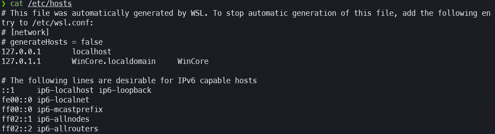
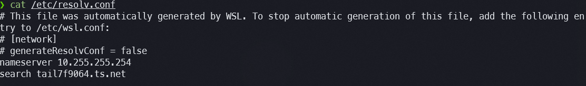
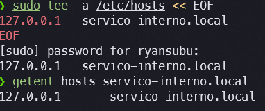
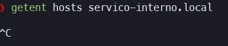

# Exercício 6 — DNS e hosts

---

## Estado Atual da Resolução de Nomes

### Comando 1: `cat /etc/hosts` (linhas úteis)

```
❯ cat /etc/hosts
127.0.0.1       localhost
127.0.1.1       WinCore.localdomain     WinCore

::1     ip6-localhost ip6-loopback
fe00::0 ip6-localnet
ff00::0 ip6-mcastprefix
ff02::1 ip6-allnodes
ff02::2 ip6-allrouters
```

O arquivo foi gerado automaticamente pelo WSL (conforme o comentário no topo original, que instrui como desabilitar a geração automática em `/etc/wsl.conf`). Contém as entradas padrão mínimas: `127.0.0.1 localhost` para resolução local IPv4 e `127.0.1.1 WinCore` mapeando o hostname da máquina. As entradas `ff02::` são endereços multicast IPv6 padronizados (RFC 4291) e não representam nomes resolvíveis por aplicações comuns.



---

### Comando 2: `cat /etc/resolv.conf`

```
❯ cat /etc/resolv.conf
nameserver 10.255.255.254
search tail7f9064.ts.net
```

O resolvedor configurado é `10.255.255.254`, que é o DNS stub interno do WSL2 — um proxy que encaminha consultas ao DNS configurado no Windows host. A linha `search tail7f9064.ts.net` é o domínio de busca da rede Tailscale: quando uma aplicação tenta resolver um nome sem ponto (ex.: `meu-servidor`), o sistema automaticamente tenta `meu-servidor.tail7f9064.ts.net` antes de retornar falha. Isso permite endereçar máquinas Tailscale por nome curto.



---

## Criação e Teste de Nome Fictício via `/etc/hosts`

### Adicionando a entrada

```bash
sudo tee -a /etc/hosts << EOF
127.0.0.1   servico-interno.local
EOF
```

O comando `tee -a` abre o arquivo em modo append (`-a`) e escreve o conteúdo recebido via stdin — neste caso, o heredoc `<< EOF`. O resultado é a adição da linha `127.0.0.1 servico-interno.local` ao final do arquivo sem apagar o conteúdo existente. O `sudo` é necessário porque `/etc/hosts` pertence ao root.

---

### Prova que resolve: `getent hosts servico-interno.local`

```
❯ getent hosts servico-interno.local
127.0.0.1       servico-interno.local
```

**Conclusão:** Evidência indica que a resolução funcionou via `/etc/hosts`. O comando `getent hosts` consulta os mecanismos de resolução de nomes do sistema na ordem definida em `/etc/nsswitch.conf` (tipicamente `files dns` — primeiro arquivos locais, depois DNS). O retorno de `127.0.0.1` confirma que a entrada foi lida de `/etc/hosts` antes de qualquer consulta ao servidor DNS externo.



---

### Removendo a entrada

```bash
sudo sed -i '/servico-interno.local/d' /etc/hosts
```

O comando `sed -i` edita o arquivo in-place. A expressão `/servico-interno.local/d` instrui o sed a deletar (`d`) todas as linhas que contenham o padrão `servico-interno.local`. O resultado é a remoção cirúrgica apenas da linha adicionada, sem afetar o restante do arquivo.

---

### Prova que não resolve mais

```
❯ getent hosts servico-interno.local
❯
```

A ausência de saída confirma que `servico-interno.local` não resolve mais. `getent` retornou código de saída não-zero (falha), pois o nome não existe em `/etc/hosts` e nenhum servidor DNS autoritativo conhece esse nome fictício. Se existisse entrada DNS para ele, ainda resolveria — o que confirma que a resolução anterior dependia exclusivamente do arquivo local.



---

## Diferença Prática: `/etc/hosts` vs DNS

A diferença fundamental entre os dois mecanismos está em **quem detém a informação** e **como ela se propaga**.

O `/etc/hosts` é um arquivo local, editado manualmente e consultado somente pelo host onde reside. A resolução é instantânea (sem latência de rede), não depende de nenhum serviço externo e tem precedência sobre o DNS na ordem padrão do `nsswitch.conf`. Por isso é útil para sobrescrever temporariamente um nome (ex.: apontar `api.empresa.com` para um servidor de teste durante desenvolvimento) ou para nomear serviços em ambientes sem DNS.

O DNS, por outro lado, é um sistema distribuído e hierárquico (RFC 1034/1035). Uma entrada criada num servidor DNS autoritativo torna-se automaticamente disponível para **todos os hosts** que usam aquele servidor — sem edição local em cada máquina. Suporta TTL (tempo de vida), registros especializados (A, AAAA, CNAME, MX, TXT), delegação de zonas e alta disponibilidade. Em ambientes com dezenas ou centenas de hosts, gerenciar nomes via DNS é a única abordagem escalável.

---

## Riscos de Usar `/etc/hosts` como Solução Permanente em Produção

### Risco 1 — Falta de propagação e inconsistência entre hosts

Uma entrada em `/etc/hosts` existe apenas na máquina onde foi criada. Em um ambiente com múltiplos servidores, cada máquina precisaria da mesma edição manual — e qualquer divergência (um host com a entrada antiga, outro sem) causa comportamentos inconsistentes e difíceis de diagnosticar. Em um cluster com 50 servidores, manter `/etc/hosts` sincronizado manualmente é inviável e propenso a erros.

### Risco 2 — Ausência de TTL e atualizações que não se propagam

O DNS possui TTL (Time To Live) em cada registro: quando um endereço IP muda, o administrador atualiza o registro DNS e, após o TTL expirar, todos os clientes passam a usar o novo IP automaticamente. Com `/etc/hosts`, não existe esse mecanismo: se o IP de um serviço muda, é necessário editar manualmente **todos** os arquivos `/etc/hosts` de **todas** as máquinas que referenciam aquele nome — gerando janelas de falha e risco de arquivos desatualizados ficarem indefinidamente em produção sem que ninguém perceba.