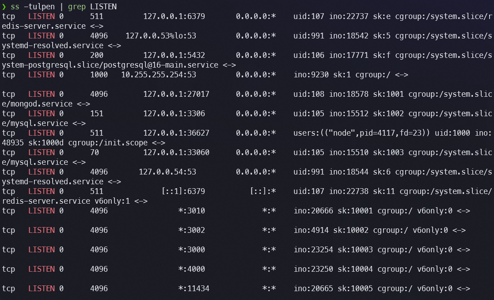

# Exercício 9 — Portas TCP

---

## Mapeamento de Portas TCP em Escuta

### Comando: `ss -tulpen` (filtrado para TCP LISTEN)

```
❯ ss -tulpen | grep LISTEN
tcp  LISTEN  0  70      127.0.0.1:33060    0.0.0.0:*   uid:105 ino:14484  cgroup:/system.slice/mysql.service
tcp  LISTEN  0  1000   10.255.255.254:53   0.0.0.0:*   ino:12298          cgroup:/
tcp  LISTEN  0  4096    127.0.0.54:53      0.0.0.0:*   uid:991 ino:20020  cgroup:/system.slice/systemd-resolved.service
tcp  LISTEN  0  4096    127.0.0.1:27017    0.0.0.0:*   uid:108 ino:5911   cgroup:/system.slice/mongod.service
tcp  LISTEN  0  151     127.0.0.1:3306     0.0.0.0:*   uid:105 ino:14486  cgroup:/system.slice/mysql.service
tcp  LISTEN  0  511     127.0.0.1:37177    0.0.0.0:*   users:(("node",...)) uid:1000 ino:21877
tcp  LISTEN  0  200     127.0.0.1:5432     0.0.0.0:*   uid:106 ino:25694  cgroup:/system.slice/postgresql
tcp  LISTEN  0  511     127.0.0.1:6379     0.0.0.0:*   uid:107 ino:4608   cgroup:/system.slice/redis-server.service
tcp  LISTEN  0  4096    127.0.0.53%lo:53   0.0.0.0:*   uid:991 ino:20018  cgroup:/system.slice/systemd-resolved.service
tcp  LISTEN  0  511     [::1]:6379         [::]:*       uid:107 ino:4609   cgroup:/system.slice/redis-server.service
tcp  LISTEN  0  4096    *:4000             *:*          ino:27176
tcp  LISTEN  0  4096    *:11434            *:*          ino:10609
tcp  LISTEN  0  4096    *:3000             *:*          ino:22845
tcp  LISTEN  0  4096    *:3002             *:*          ino:2942
```

**Tabela resumida das portas TCP em escuta:**

| Porta | Endereço | Serviço identificado | Exposição |
|---|---|---|---|
| 3306 | 127.0.0.1 | MySQL (porta principal) | Somente loopback |
| 33060 | 127.0.0.1 | MySQL X Protocol | Somente loopback |
| 27017 | 127.0.0.1 | MongoDB | Somente loopback |
| 5432 | 127.0.0.1 | PostgreSQL | Somente loopback |
| 6379 | 127.0.0.1 e ::1 | Redis | Somente loopback (IPv4 e IPv6) |
| 37177 | 127.0.0.1 | Node.js (processo pid=5073) | Somente loopback |
| 53 | 127.0.0.53, 127.0.0.54, 10.255.255.254 | DNS (systemd-resolved + WSL DNS) | Loopback + WSL interno |
| 3000 | * | Aplicação web (ex.: servidor de desenvolvimento) | **Todas as interfaces** |
| 3002 | * | Aplicação web | **Todas as interfaces** |
| 4000 | * | Aplicação web | **Todas as interfaces** |
| 11434 | * | Ollama (servidor de modelos LLM) | **Todas as interfaces** |



---

## Análise de Portas Específicas

### Porta "comum" identificada: porta 22 (SSH)

```bash
❯ ss -tulpen | grep ':22'
(sem saída)
```

A porta 22 (SSH) **não está em escuta** neste host. No WSL2, o servidor SSH do Linux não é iniciado por padrão, e o acesso remoto ao WSL normalmente ocorre via terminal do Windows diretamente, sem necessidade de SSH interno. Em um servidor Linux convencional, a porta 22 estaria presente e associada ao processo `sshd`.

Para verificar outras portas comuns que **estão** em uso:

- **Porta 80 (HTTP):** não está em escuta — nenhum servidor web exposto na porta padrão
- **Porta 443 (HTTPS):** não está em escuta — confirmado pela ausência na saída do `ss`
- **Porta 3306 (MySQL):** ✅ em escuta em `127.0.0.1:3306`, processo `mysql.service` (uid:105)

A porta 3306 é a porta padrão do MySQL, amplamente conhecida. Está corretamente vinculada a `127.0.0.1` (somente loopback), o que significa que só é acessível de dentro do próprio host — nenhuma conexão externa é aceita. O processo é identificado pelo `cgroup:/system.slice/mysql.service`, confirmando que é o servidor MySQL gerenciado pelo systemd.

---

### Porta alta escolhida para serviço novo: **porta 55200**

Para um serviço hipotético de API interna (ex.: um microserviço de notificações):

**Justificativa da escolha:**

A faixa 50000–60000 é segura para serviços de desenvolvimento e internos porque:

1. **Não conflita com portas bem conhecidas (Well-Known Ports, 0–1023):** estas exigem privilégio root para bind — qualquer processo que tente escutar na porta 80 ou 443 sem `CAP_NET_BIND_SERVICE` recebe erro de permissão.
2. **Não conflita com portas registradas (Registered Ports, 1024–49151):** estas são atribuídas pela IANA a protocolos específicos (ex.: 3306=MySQL, 5432=PostgreSQL, 6379=Redis). Usar uma porta registrada para outro serviço cria confusão operacional.
3. **Está na faixa de portas efêmeras (Ephemeral Ports, 49152–65535) mas fora do range padrão do kernel Linux:** o Linux reserva por padrão as portas 32768–60999 para conexões de saída (verificável em `/proc/sys/net/ipv4/ip_local_port_range`). A porta 55200 cai nessa faixa, portanto o ideal seria verificar o range atual e escolher 61000–65000 para garantir que o kernel não atribua a porta a uma conexão de saída no momento errado. Alternativamente, pode-se ajustar o `ip_local_port_range`.

A porta 55200 foi escolhida por ser um número redondo, fácil de lembrar, e verificavelmente livre na tabela acima.

**Verificação de disponibilidade:**

```bash
❯ ss -tulpen | grep ':55200'
(sem saída — porta livre)
```

---

## Risco de Escutar em `0.0.0.0` vs `127.0.0.1`

A diferença entre `0.0.0.0` (ou `*`) e `127.0.0.1` como endereço de bind é a diferença entre **exposição pública** e **isolamento local** — e tem impacto direto na superfície de ataque do sistema.

Quando um serviço faz bind em `127.0.0.1`, o kernel aceita conexões **apenas** originadas do próprio host, pela interface de loopback. Nenhum pacote vindo da rede (LAN, internet, VPN) consegue alcançar aquela porta — o kernel descarta silenciosamente antes mesmo de o processo receber a conexão. Isso é válido para serviços que só precisam ser acessados localmente, como bancos de dados (MySQL, PostgreSQL, MongoDB, Redis) que servem apenas à aplicação no mesmo host.

Quando um serviço faz bind em `0.0.0.0`, ele aceita conexões em **todas as interfaces do host simultaneamente** — loopback, LAN, internet, VPN. Qualquer host que consiga alcançar o IP do servidor pela rede pode tentar conectar àquela porta. Isso é necessário para serviços que precisam ser acessíveis externamente (servidores web, APIs públicas), mas é perigoso quando aplicado a serviços que não deveriam ser expostos.

No ambiente analisado, as portas 3000, 3002, 4000 e 11434 estão em `*` (0.0.0.0 + ::). A porta 11434 é particularmente relevante: é o Ollama, um servidor de modelos LLM local. Exposto em todas as interfaces, qualquer máquina na mesma rede (incluindo potencialmente a internet, dependendo do roteador) pode enviar requisições ao modelo — o que pode ter implicações de segurança, custo computacional e privacidade de dados enviados ao modelo. A boa prática seria iniciar o Ollama com `OLLAMA_HOST=127.0.0.1:11434` para restringir o acesso ao loopback, liberando externamente somente se houver necessidade justificada e proteção por firewall ou autenticação.